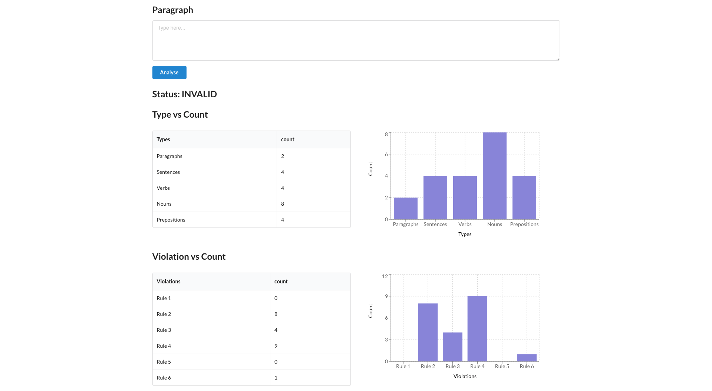

# Prospection Coding Exercise

The exercise is in Spring Boot and requires at least Java 11. It also uses Gradle and React.

So firstly, setup:

1. Clone the provided repo and create a branch to submit your work
2. To build the project and run the Java tests, run `./gradlew clean build`.
3. Import the Spring Boot project to your IDE (optional).
4. Run the project backend with your IDE or run `./gradlew bootrun`.
5. Go to frontend folder (`cd frontend`), run `npm install`, then run `npm start`. It will open your browser to the url `http://localhost:3000/`.

After these steps, you should see a web page where a few components are wired up, but the numbers are not real. You **must** fix that.

**_IMPORTANT !!!_**

**_Feel free to add dependencies and change the project structure as you see fit_**

**_If something is not clear, write down an assumption in the code and move on_**

# The Task at Hand

We are creating a new language for the creatures in our fantasy world to speak, read and write in.

They will all speak the same language, and the grammar is well-defined.

Based on the grammar definition we can extract some rules.

You will then validate a piece of text against these rules.

We are defining the language with the following concepts:

## Alphabet

The alphabet is quite simple and has the following characters:

    a b c d e f g h i j k l m n o p q r s t u

(that is: `a`-`u`)

They can be lowercase or uppercase letters.

It also contains: `space`, `.`, `!`.

**_Rule 1_**: no other characters are valid

## Words

Words containing 1 to 8 characters and are separated by one or more spaces.

**_Rule 2_**: words that are longer than 8 characters are invalid

## Verbs

Verbs are words comprised of 4-5 characters.

They have 3 tenses: Past, Present and Future.

* Past verbs are ending in `d`.

* Present verbs are ending in `r`.

* Future verbs are ending in `l`.

**_Rule 3_**: verbs must end in `d`, `r` or `l`

Clarifications:
* Sometimes our fantasy creatures make a mistake and write weird symbols that doesn't belong to the alphabet. We will tolerate that and still consider it a word. The out-of-place symbol also counts as a character when determining the type of the word. (We are developing a secret AI that can correct these symbols, so let's keep them in the count for the time being.)
* However, if a word is over 8 characters long, it's too much effort to auto-correct it. We will classify it as not belonging to any of the 3 types of word.

## Nouns

Nouns are words comprised of 6-8 characters.

## Prepositions

Prepositions are words composed of 1-3 characters.

## Sentences

Sentences end with a dot '.' or exclamation mark '!'.

**_Rule 4_**: There must be at least 1 noun, at least 1 verb and at least 1 preposition in a sentence.

Clarifications:
* Sometimes our less educated fantasy creatures write consecutive `.` and/or `!`(for example "fhijlmn sqrd es pmopfegd...") which may be seen as "empty sentences" following normal sentences. We should be kind to them and ignore these empty sentences like they weren't there.
* Sometimes they might forget to add the final `!` in the last sentence in a paragraph. We will kindly count that as a sentence as well, although we should remind them of their mistake(see below, Rule 6).

## Paragraph

Paragraphs are a block of consecutive text with up to 3 sentences. Each paragraph starts in a new line and ends with a line break.

**_Rule 5_**: Paragraphs have 1 to 3 sentences.

**_Rule 6_**: The last sentence in a paragraph must end with an exclamation sign `!`

Clarifications:
* Similar to sentences, consecutive link breaks will cause "empty paragraphs", and they will be ignored too.

# Your Goals

Implement an algorithm that accepts a piece of text and validates it against the grammar above.

Present the results in a UI.

## Criteria
Apart from **correctness**, we will evaluate your approach in **designing** and **building** a fullstack web application.

Do your best to improve the project as if it will be **deployed to production**. If this is not possible, please include in your pull-request a description of what is needed to make it production ready.

## Backend

The backend code should provide an API to be consumed by the frontend.

This API must return:

* VALID or INVALID status

* It should return a list of rules that have been violated, and a count of how many times they've been violated. 

* It should return the count of Verbs, Nouns, Prepositions, Sentences and Paragraph.

Clarification - We would like to pick up as many violations as possible, while being tolerant to our fantasy creatures' mistakes. This means:

* If an object violates multiple rules, all the violations should be counted. Example: "qwertyuiop" should be counted once for Rule 1 violation and once for Rule 2 violation.
* Even if an object violates any grammar rules, it'll still be counted as that object type. Example: the word "tuv" violates Rule 1, but we should still count it as a preposition. "fgeursq fdsl." is missing preposition as a sentence, but we'll still count it as a sentence.
* The only exception is Rule 2, because if a word is too long, we cannot determine its word type, therefore it won't be count as any of Noun, Verb or Preposition. In the same way, a sentence including only 1 word that violates rule 2 won't be counted as a sentence, and a paragraph containing this invalid sentence only won't be counted as a paragraph.

## Frontend

The frontend code is partially provided (frontend folder - check README) as a React Single Page Application.

There is an input text, and the outcome is 2 sets of table and chart pairs.

The UI should look like this:

## Examples

### Valid

    Cufabiu maffas nonad in auguec finibu soliciu. Mauhis arcusu semihe ir digil quisam impediec es macir quisua nullac. Nullam quir poral ac merul!
    Doneca punar de us nequl placeran sincdun. Neqed nil ulrices es hiraec qua rempl lacuse hisaec ers!

### Invalid

    Nunddz id ulits orci. Cufabiu nonad in augueculrices. Aenean aucbor purusa.
    Vivamus libero enim, sagittis at nulla in, malesuada pretium nunc. Donec punar de, ut nequl placeran tincdun. Neqed nil ulrices es. Vitae qua templ lacuse vitaec est!
    
#### Explanation

Text                          | Status
:-----------------------------| :---  
Nunddz, sagittis, ut, tincdun | Rule 1 - invalid character
augueculrices                 | Rule 2 - word is too long
Ulics                         | Rule 3 - verb not ending with `d`, `r` or `l`
Aenean aucbor purusa.         | Rule 4 - no preposition at the sentence
2nd paragraph                 | Rule 5 - too many sentences
1st paragraph                 | Rule 6 - not ending with `!`

# Submission

Create a branch out of the repo, submit pull-request and notify us about completion
